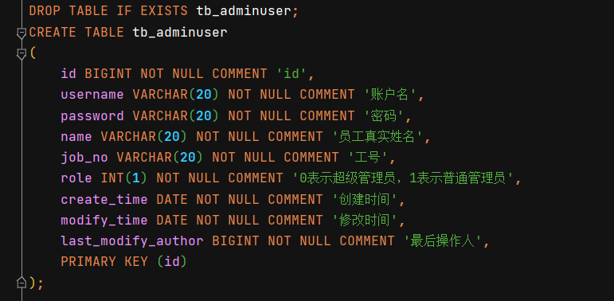
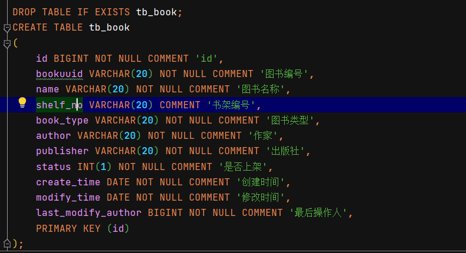
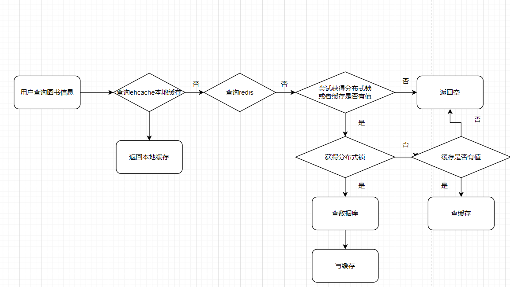

这是一个图书管理系统，图书管理系统包含两个实体，第一是管理员，第二是图书。

下面是管理员和图书的实体图：

员工实体图

图书实体图

技术方案：

springboot作为主要的开发框架，ORM层用mybatis-plus去做。

存储层利用ehcache + redis + h2数据库实现了一个二级缓存的图书管理系统，图书管理相关的表项有图书表和管理员表，表结构看schema.sql

除此之外，这里插入接口的数据库主键的生成是利用了zookeeper做的全局计数器。

设置简单架构图如下

